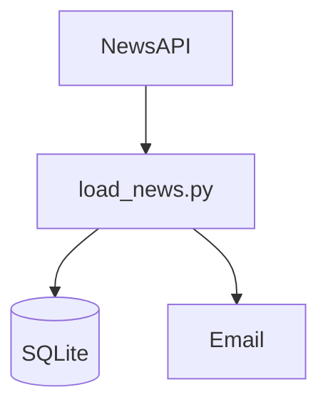

# WC 2026 News Pipeline

## Objetivo
Desarrollé este proyecto con fines educativos para aprender conceptos fundamentales de Data Engineering, mediante la construcción de un pipeline de datos completo. A lo largo del desarrollo se trabajó con consumo de APIs, almacenamiento en bases de datos, deduplicación de datos, automatización de tareas, gestión de credenciales mediante variables de entorno y control de versiones con Git.

## Descripción
Consiste en un pipeline automatizado que consulta periódicamente NewsAPI para obtener noticias sobre la Copa Mundial de la FIFA 2026. Las almacena y evita duplicados mediante SQLite y envía por correo electrónico únicamente las noticias nuevas.

## Arquitectura



## Tecnologías utilizadas
- Python

- SQLite

- NewsAPI

- SMTP (Gmail)

- python-dotenv

- Git

- Programador de tareas de Windows


## Instalación
1. Clonar el repositorio.

```bash
git clone <URL-del-repositorio>
cd WC-NEWS-PIPELINE
```

2. Crear un entorno virtual.

```bash
python -m venv .venv
```

3. Activar el entorno virtual.

Windows:

```bash
.venv\Scripts\activate
```

4. Instalar las dependencias.

```bash
pip install -r requirements.txt
```

Linux/macOS:

```bash
source .venv/bin/activate
```

4. Instalar las dependencias.

```bash
pip install -r requirements.txt
```


## Configuración

El proyecto utiliza variables de entorno para almacenar credenciales y configuraciones sensibles.

Antes de ejecutar el pipeline, crear un archivo `.env` en la raíz del proyecto tomando como referencia `.env.example`.:


El archivo debe contener las siguientes variables:

```env
NEWS_API_KEY=tu_api_key
EMAIL_USER=tu_correo
EMAIL_PASSWORD=tu_password_de_aplicacion
```

Estas variables son cargadas automáticamente mediante `python-dotenv`.

El archivo `.env` no debe ser incluido en el control de versiones.


## Ejecución

### Ejecución manual

Desde la carpeta raíz del proyecto, con el entorno virtual activado:

```bash
python src/load_news.py
```

El pipeline realizará las siguientes tareas:

- Consulta la API de noticias.
- Procesa los artículos obtenidos.
- Almacena las noticias nuevas en SQLite.
- Envía por correo electrónico las noticias incorporadas.

### Ejecución automatizada

El pipeline puede ejecutarse automáticamente mediante el Programador de tareas de Windows.

La tarea programada ejecuta periódicamente el script:

```bash
python src/load_news.py
```

utilizando el intérprete de Python correspondiente al entorno virtual del proyecto.

Actualmente la ejecución está configurada para realizarse diariamente.


## Estructura del proyecto

```text
WC-NEWS-PIPELINE/
│
├── src/               # Código fuente del pipeline
│    ├── load_news.py  # Pipeline principal         
├── tests/             # Scripts de prueba y experimentación
├── database/          # Base de datos SQLite
├── notas/             # Documentación y apuntes del desarrollo
├── .env.example       # Plantilla ejemplo de variables de entorno
├── requirements.txt   # Dependencias del proyecto
└── README.md          # Documentación
```

## Mejoras futuras