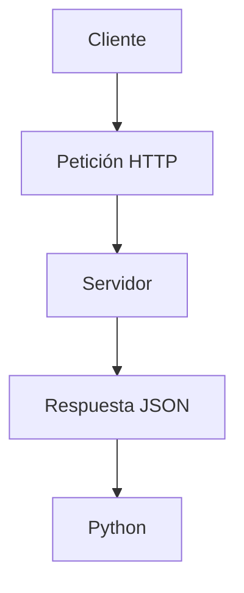

# APIs

## ¿Qué es una API?

Una API permite que dos programas se comuniquen entre sí.

## ¿Qué es un endpoint?

Un endpoint es una URL que identifica un servicio específico de una API.

Ejemplo:

https://api.ejemplo.com/users

## ¿Qué es una petición HTTP?

Una solicitud enviada por un cliente a un servidor.

## requests.get()

Envía una petición HTTP GET.

## ¿Qué es response?

Objeto que representa la respuesta completa del servidor.

## response.status_code

Código de estado HTTP.

## response.json()

Convierte el JSON recibido en estructuras de Python.

## JSON

Formato estándar para intercambiar datos.

## json.dumps()

Convierte estructuras de Python en texto JSON.

## Flujo general de consumo de una API

